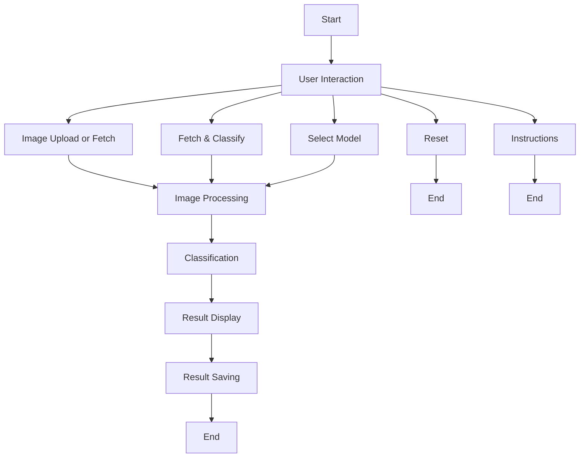

```mermaid
graph TD;
    A[Start] --> B[User Interaction];
    B --> C[Image Upload or Fetch];
    C --> D[Image Processing];
    D --> E[Classification];
    E --> F[Result Display];
    F --> G[Result Saving];
    G --> H[End];
    B --> I[Fetch & Classify];
    I --> D;
    B --> J[Reset];
    J --> K[End];
    B --> L[Select Model];
    L --> D;
    B --> M[Instructions];
    M --> N[End];
```