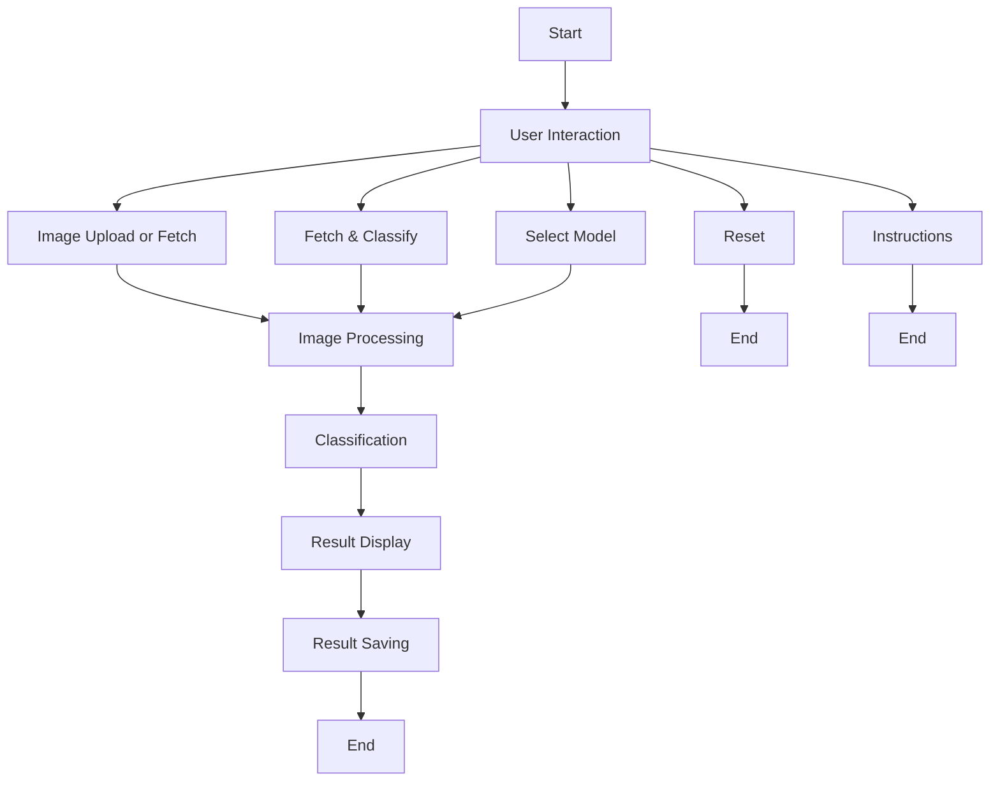

## Program/Project Overview

This project is an image classification application built with Streamlit, a popular framework for creating web applications for machine learning and data science projects. The application leverages pre-trained models to classify images uploaded by users or fetched from online sources like Unsplash and Pexels. The primary goal is to provide an interactive platform for users to explore and understand the capabilities of image classification models through a user-friendly interface.

## Objective

The objective of this project is to demonstrate the power of pre-trained models in image classification tasks. It aims to provide a practical application that showcases how these models can be integrated into web applications to offer real-time image classification services. The project also serves as a foundation for further development and enhancements, including the addition of more models, features, and functionalities.

## Architecture

### Components

- **Streamlit**: The core framework for building the web application.
- **PIL (Python Imaging Library)**: Used for opening, manipulating, and saving many different image file formats.
- **Pre-trained Models**: The application utilizes pre-trained models for image classification. The specific models used are not detailed in the provided code but are likely to be deep learning models trained on large datasets.
- **Sidebar**: A custom module for displaying the application's sidebar, which includes instructions and options for users.
- **Image Processing**: A module for handling image processing tasks, such as classifying images.
- **App Management**: Contains functions for fetching and classifying images from Unsplash and Pexels, as well as alternating between these sources.
- **File Operations**: Handles saving images to the local file system.
- **Results**: Processes and saves the classification results to an Excel file.
- **Instructions**: Provides instructions for using the application.

### Architecture Diagram

```
+-------------------+     +-------------------+     +-------------------+
|                   |     |                   |     |                   |
|   Streamlit App   |<--->|   Sidebar Module |<--->| Image Processing |
|                   |     |                   |     |                   |
+-------------------+     +-------------------+     +-------------------+
         |                        |                        |
         |                        |                        |
         v                        v                        v
+-------------------+     +-------------------+     +-------------------+
|                   |     |                   |     |                   |
| App Management    |     | File Operations   |     | Results           |
|                   |     |                   |     |                   |
+-------------------+     +-------------------+     +-------------------+
```

## Functions, Operations, and Features

### Functions

- **Display Sidebar**: Displays the application's sidebar with instructions and options for users.
- **Classify Images**: Classifies uploaded images using a specified pre-trained model.
- **Fetch and Classify Images**: Fetches images from Unsplash or Pexels and classifies them using a specified pre-trained model.
- **Save Image to Local**: Saves uploaded images to the local file system.
- **Process and Save Results**: Processes and saves the classification results to an Excel file.

### Operations

- **Image Upload**: Users can upload images to be classified.
- **Image Fetching**: Users can fetch images from Unsplash or Pexels for classification.
- **Classification**: Images are classified using pre-trained models.
- **Result Display**: Classification results are displayed in the application.
- **Result Saving**: Classification results are saved to an Excel file.

### Features

- **User-friendly Interface**: The application provides a simple and intuitive interface for users to interact with.
- **Real-time Classification**: Images are classified in real-time, providing immediate feedback to users.
- **Image Saving**: Users can save uploaded images to the local file system.
- **Result Export**: Classification results can be exported to an Excel file for further analysis.

## Process

1. **User Interaction**: Users interact with the application through the Streamlit interface, uploading images or selecting options to fetch images from Unsplash or Pexels.
2. **Image Processing**: Uploaded images are processed, and if specified, images are fetched from Unsplash or Pexels.
3. **Classification**: Images are classified using pre-trained models.
4. **Result Display**: Classification results are displayed in the application.
5. **Result Saving**: Users have the option to save classification results to an Excel file.

## Detailed Descriptions

### Image Processing

The `image_processing.py` file contains functions for selecting the appropriate model based on the user's choice, processing the image to match the model's requirements, and classifying the image using the selected model. The `classify_images` function preprocesses the image, selects the model, and uses the model to classify the image. The results are then converted into a DataFrame for easy display and further processing.

### App Management

The `app_mgt.py` file handles the fetching and classifying of images from Unsplash and Pexels. It uses the `fetch_images` function to fetch images from the selected site, save them locally, and then classify them using the specified model. The `fetch_and_classify_unsplash_images` and `fetch_and_classify_pexels_images` functions are specifically designed for fetching and classifying images from Unsplash and Pexels, respectively.

### File Operations

The `file_operations.py` file is responsible for saving images to the local file system. It contains functions for creating directories, deleting directories, saving uploaded images, and saving fetched images. The `save_image_to_local` function ensures that the directory exists before saving the image, and the `save_fetched_image` function saves the fetched image content to the specified path.

### Display App

The `display_app.py` file contains functions for displaying the image and its classification results in the Streamlit app. The `display_app` function displays the image and the classification results in a user-friendly format, making it easy for users to understand the classification results.

### Instructions

The `instructions.py` file provides instructions for using the application. The `instructions` function returns a markdown string that contains detailed instructions on how to use the application, including how to upload images, select models, and view the classification results.

### Sidebar

The `sidebar.py` file is responsible for displaying the application's sidebar, which includes options for users to upload images, select models, and fetch images from Unsplash or Pexels. The `display_sidebar` function creates the sidebar with all the necessary options and buttons for user interaction.

### API Management

The `api.py` file manages the API usage for fetching images from Unsplash and Pexels. It contains functions for checking the API usage, resetting the API usage count, and loading the API access key from a configuration file. The `check_api_usage` function ensures that the application does not exceed the API usage limit for the selected site.

This detailed overview, combined with the code snippets and the project's architecture, provides a comprehensive understanding of the project, its components, and its functionality. It can serve as a solid foundation for creating a detailed README.md file for your GitHub repository, guiding users on how to use your application, contribute to its development, and explore its capabilities.


## Future Enhancements for Rev2 Phase

### 1. Integration of More Pre-trained Models

- **Deep Learning Models**: Explore integrating additional deep learning models such as EfficientNet, MobileNet, and DenseNet for image classification. This will allow users to choose from a wider range of models, potentially improving classification accuracy and speed.

### 2. Custom Model Training Option

- **Custom Model Training**: Implement a feature that allows users to train their own models using a dataset of their choice. This could involve uploading a dataset, selecting a pre-trained model as a base, and training the model on the new dataset.

### 3. Real-time Image Classification with Webcam

- **Webcam Integration**: Add functionality to classify images in real-time using a webcam. This would make the application more interactive and engaging for users.

### 4. Enhanced User Interface

- **Responsive Design**: Ensure the application's user interface is responsive and works well on various devices and screen sizes. This could involve improving the layout, adding more interactive elements, and ensuring fast loading times.

### 5. Advanced Image Processing Features

- **Image Augmentation**: Implement image augmentation techniques to increase the diversity of the training dataset, which can help improve model performance.
- **Object Detection**: Integrate object detection capabilities to identify and classify specific objects within an image.

### 6. Improved Results Visualization

- **Interactive Results**: Enhance the visualization of classification results to make them more interactive and informative. This could include interactive charts, detailed explanations of the classification process, and the ability to compare results across different models.

### 7. User Accounts and Personalization

- **User Accounts**: Implement user accounts to allow users to save their favorite models, datasets, and classification results. This could also include personalized recommendations based on the user's past interactions with the application.

### 8. API Integration for Advanced Features

- **Advanced API Features**: Explore integrating advanced features from APIs such as image recognition, object detection, and facial recognition. This could involve using APIs to fetch images, classify images, or even analyze the content of the images.

### 9. Documentation and Tutorials

- **Comprehensive Documentation**: Create detailed documentation and tutorials to help users understand how to use the application effectively. This could include step-by-step guides, FAQs, and troubleshooting tips.

### 10. Community Features

- **Community Features**: Implement features that allow users to share their models, datasets, and classification results with the community. This could include a forum, a gallery of shared models, and the ability to vote or comment on shared content.

### 11. Improve Error Handling and User Feedback
- **Enhancement**: Implement more robust error handling throughout the application. This includes handling exceptions gracefully and providing clear feedback to the user when something goes wrong. For example, if an image fails to classify, the application could display a user-friendly message explaining the issue and suggesting possible actions.

### 12. Enhance Image Upload and Fetching Functionality
- **Enhancement**: Add the ability to upload multiple images at once. This would improve the user experience by allowing users to classify multiple images in a single session without having to upload them one by one.
- **Enhancement**: Improve the image fetching functionality by adding filters or search terms. This would allow users to fetch images that are more relevant to their interests or the specific classification task they are performing.

### 13. Improve Classification Results Display
- **Enhancement**: Enhance the visualization of classification results. Consider using interactive charts or graphs to display the classification results. This could help users better understand the model's predictions and the confidence levels associated with each prediction.
- **Enhancement**: Add the option to sort or filter the classification results based on various criteria, such as confidence level or class name. This would allow users to focus on the most relevant results.

### 14. Enhance User Interface and Experience
- **Enhancement**: Improve the application's layout and design to make it more visually appealing and user-friendly. This could include using a consistent color scheme, improving the typography, and ensuring that the application is responsive and works well on various devices and screen sizes.
- **Enhancement**: Add tooltips or help texts to guide users on how to use different features of the application. This could include instructions on how to upload images, select models, and interpret the classification results.

### 15. Improve Performance and Efficiency
- **Enhancement**: Optimize the image processing and classification steps to improve the application's performance. This could involve using more efficient image processing techniques or optimizing the model's inference time.
- **Enhancement**: Implement caching mechanisms for frequently used images or models. This would reduce the need to reprocess or re-fetch the same images or models, thereby improving the application's efficiency and reducing the load on external APIs.

### 16. Enhance Documentation and User Guide
- **Enhancement**: Create a more detailed user guide or tutorial that explains how to use the application, including step-by-step instructions for common tasks. This could help new users get started with the application more easily.
- **Enhancement**: Add comments and documentation to the codebase to improve its readability and maintainability. This would make it easier for other developers to understand and contribute to the project.

### 17. Implement a Feedback System
- **Enhancement**: Implement a feedback system that allows users to provide feedback on the application's performance, features, and user experience. This could help identify areas for improvement and gather user insights that could inform future development efforts.

### 18. Additional Features
- **Enhancement**: Consider adding additional features that could enhance the application's capabilities, such as object detection, image segmentation, or the ability to compare classification results across different models.

These enhancements are designed to improve the application's usability, performance, and overall user experience, making it a more powerful and versatile tool for image classification tasks.

## Mermaid Flow Diagram for Image Classification Application



### Explanation of the Flow:

1. **Start**: The process begins.
2. **User Interaction**: Users interact with the application through the Streamlit interface, uploading images or selecting options to fetch images from Unsplash or Pexels.
3. **Image Upload or Fetch**: Users can upload images or fetch images from Unsplash or Pexels.
4. **Image Processing**: Uploaded images are processed, and if specified, images are fetched from Unsplash or Pexels.
5. **Classification**: Images are classified using pre-trained models.
6. **Result Display**: Classification results are displayed in the application.
7. **Result Saving**: Users have the option to save classification results to an Excel file.
8. **End**: The process ends.
9. **Fetch & Classify**: Users can fetch and classify images from Unsplash or Pexels.
10. **Reset**: Users can reset the application.
11. **Select Model**: Users can select a model for classification.
12. **Instructions**: Users can view instructions on how to use the application.

### Visualizing the Diagram:

To visualize this diagram, you can copy the Mermaid syntax into a Mermaid live editor available online. This will generate a visual flow diagram based on the described steps. Mermaid is a simple markdown-like script language for generating charts from text via JavaScript.

If you're using draw.io or any other diagramming tool, you would manually create the diagram by following the steps outlined above. Each box represents a step in the process, and the arrows (`-->`) represent the flow from one step to the next.

### Obtaining API Keys and Configuring the Project

Before you can use this project, you'll need to obtain API keys from Unsplash and Pexels. These keys are necessary for fetching images from these platforms.

1. **Unsplash API Key**:
   - Visit the [Unsplash Developers](https://unsplash.com/developers) page and create a new application.
   - After creating the application, you'll be provided with an Access Key. This is your Unsplash API Key.

2. **Pexels API Key**:
   - Go to the [Pexels API](https://www.pexels.com/api/) page and sign up for an API key.
   - Once you have signed up and logged in, navigate to the "API" section to find your API Key.

After obtaining the API keys, create a `json.config` file in the root directory of the project. The file should contain your API keys in the following format:

```json
{
 "Unsplash": "YOUR_UNSPLASH_API_KEY",
 "Pexels": "YOUR_PEXELS_API_KEY"
}
```

Replace `"YOUR_UNSPLASH_API_KEY"` and `"YOUR_PEXELS_API_KEY"` with the actual keys you obtained.

### Setting Up the Environment and Running the Project

1. **Clone the Repository**:
   ```
   git clone https://github.com/yourusername/ImageClassification.git
   ```

2. **Create a Conda Environment**:
   It's recommended to use a Conda environment to manage the project's dependencies. Create a new environment and activate it:
   ```
   conda create --name image_classification python=3.8
   conda activate image_classification
   ```

3. **Install Required Packages**:
   Navigate to the project directory and install the required packages using the `requirements.txt` file:
   ```
   pip install -r requirements.txt
   ```

4. **Run the Streamlit Application**:
   With the environment set up and the required packages installed, you can now run the Streamlit application:
   ```
   streamlit run src/main.py
   ```

### Required Packages and Versions

Ensure you have the following packages installed in your environment. You can find the exact versions in the `requirements.txt` file.

- streamlit
- tensorflow
- PIL (Python Imaging Library)
- requests
- pandas
- python-dotenv

### Sample `api.py` for API Key Configuration

Here's a sample `api.py` file that demonstrates how to load API keys from a `json.config` file:

```python
import json

def load_api_keys():
    with open('json.config', 'r') as file:
        config = json.load(file)
    return config

# Example usage
config = load_api_keys()
print(config['Unsplash'])
print(config['Pexels'])
```

This file reads the API keys from the `json.config` file and prints them. You can modify this file to suit your project's needs, such as using the keys to authenticate API requests.

---
